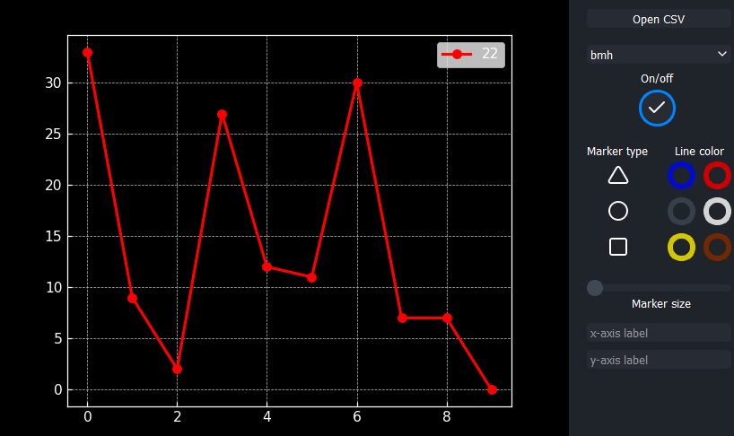

# Easy Plot

Семестровый проект студентов первого курса первого курса ЛФИ МФТИ: Егор М. и Максим В.

   

## Описание программы



Программа занимается визуализацией данных. 
На вход подаётся CSV файл. Далее отрисовываются разные графики 

## Инструкция по установке

1. Загрузка Python и дополнительных библиотек.
    ```
    1. Установите Python с [этого](https://www.python.org/downloads/) сайта.
    2. Также проверьте наличие библиотек `PyQT5`, `pandas` и `matpotlib`
   В случае её отсутствия выполните в терминале следующую команду: 
   pip install -r requirements_pip.txt
    ```

2. Склонируйте репозиторий к себе на компьютер. Для этого выполните в терминале:
```
git clone https://github.com/RogMin/MIPT-CODING_py_project.git
```
3. Для запуска программы перейдите в склонированный репозиторий и запустите файл `main.py`

## Обратная связь

Мы будем очень рады, если вы оставите отзыв, или предложите улучшения проекта. Для этого можно пользоваться **Issues**. Нам будет приятно ответить на ваши сообщения.
